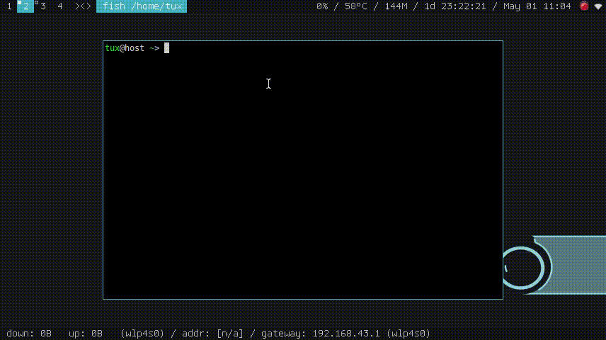

prmck
=====
**prmck** is a tool for [CRUX](https://crux.nu/) that allows you to check if any file system permissions are broken or different from the original (.footprint).

Usage
-----
Scan all installed packages:

    $ prmck all
Scan for packages installed on core ports:

    $ prmck core
Scan and Fix permissions:

    # prmck -f core
Help:

    $ prmck -h

Demo
----

